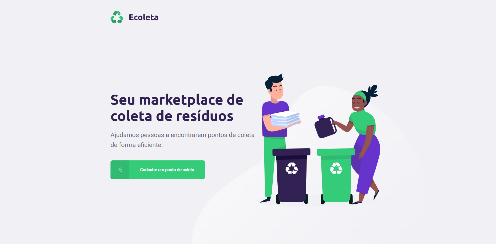
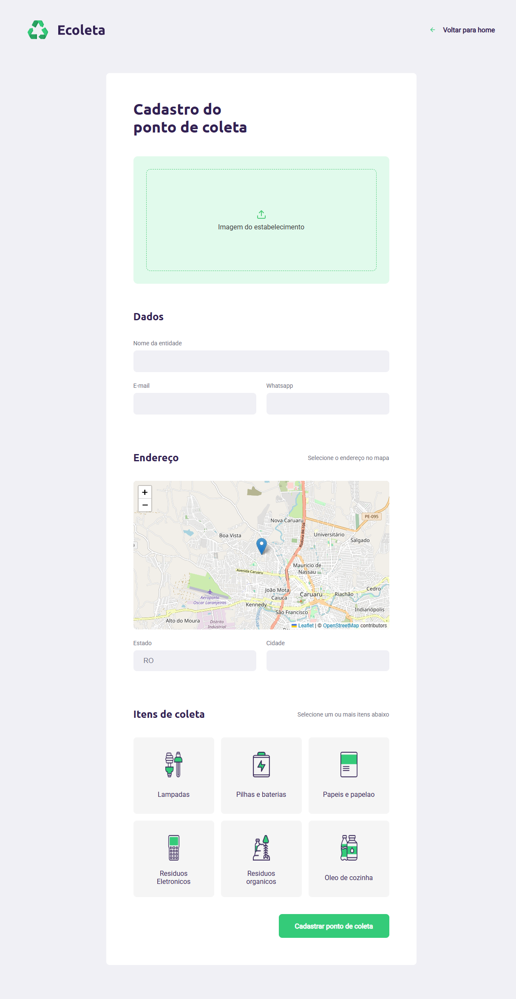
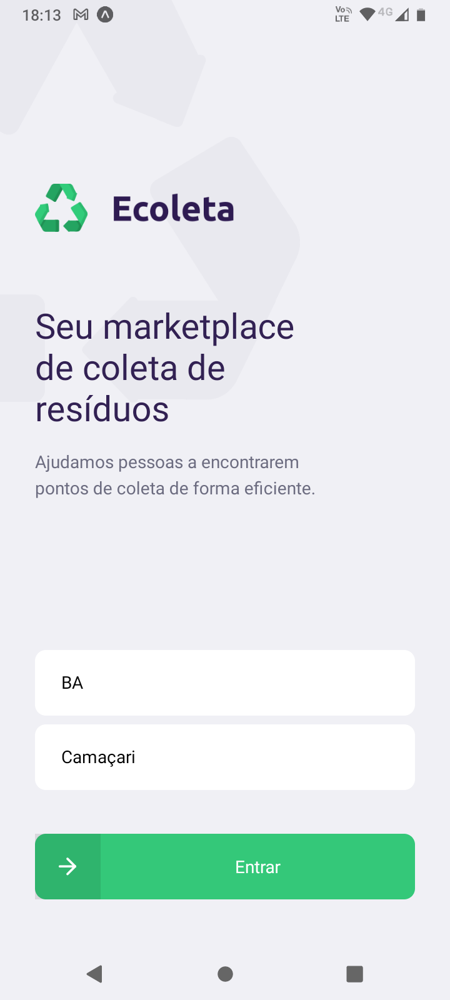
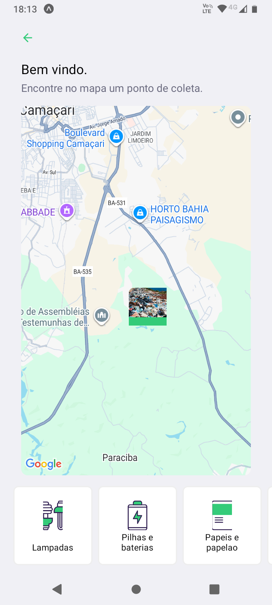
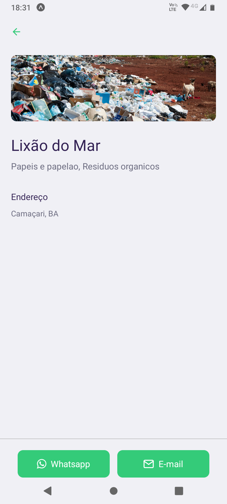

# E-Coleta

**E-Coleta** é uma aplicação criada pela Rocketseat com o objetivo de facilitar o processo de coleta de informações de pontos de coleta de materiais recicláveis em cidades brasileiras. A aplicação permite que usuários encontrem pontos de coleta, cadastrem novos pontos e explorem dados relacionados à coleta seletiva de forma prática e intuitiva.

Este projeto foi ajustado para funcionar com tecnologias atuais, garantindo compatibilidade e melhorias de desenvolvimento.

---

   

   

   

   

   

## 🚀 Tecnologias Utilizadas

**Front-end:**
- React Native
- Expo
- React Navigation / Expo Router
- Axios
- React Native Gesture Handler
- Safe Area Context

**Back-end:**
- Node.js com TypeScript
- Express.js
- Knex.js
- SQLite (ou PostgreSQL para produção)

**Ferramentas auxiliares:**
- Git / GitHub
- Postman ou Insomnia (para testes de API)

---

## 🎯 Objetivo da Aplicação

O E-Coleta tem como objetivo:

- Ajudar usuários a localizar pontos de coleta de materiais recicláveis.
- Permitir o cadastro de novos pontos de coleta.
- Organizar informações sobre tipos de resíduos aceitos por cada ponto.
- Oferecer uma interface intuitiva e responsiva para dispositivos móveis.

---

## ⚙️ Funcionalidades

- Listagem de pontos de coleta por cidade e estado.
- Filtro por tipo de material coletado (papel, vidro, plástico, etc.).
- Cadastro de novos pontos de coleta com informações detalhadas.
- Integração com mapa para visualização da localização dos pontos.

---

📄 Observações

Este projeto foi atualizado para funcionar com versões atuais das ferramentas, mantendo a lógica original da Rocketseat.

Algumas adaptações foram feitas para compatibilidade com sistemas operacionais modernos e dependências atualizadas.

